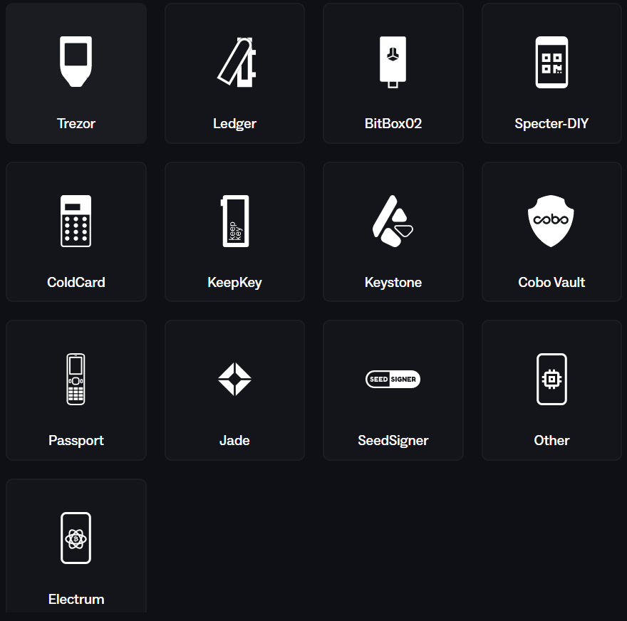

# Create a Device: In Specter Desktop

## 1. Introduction

In this user guide we will we will guide you step by step how to
use the designated hardware wallet of your choice in Specter Desktop.

### 1.1 Outline

The rest of this guide is structured as follows:  

1. Section [TL;DR Steps](tl;dr-steps-) gives a brief overview over the required steps to create an exemplary device
2.

### 1.2 Prerequisites

This guide assumes, ...

* ... that you have already successfully setup (i.e., downloaded, verified and installed) `Specter Desktop`. A brief guide on how to install Specter Desktop is given [here](../README.md#using-the-specter-desktop-app).
* ... that you already own a  "signing device". To be more precise for the purpose of this guide we assume you want to connect a hardware wallet to Specter Desktop (e.g., the Specter DIY, BitBox02, ..)

  * > A Bitcoin signing device, often referred to as a hardware wallet, is a specialized, physical device designed to securely store and manage the private keys necessary for controlling Bitcoin and other cryptocurrencies. Its primary purpose is to enhance the security of cryptocurrency holdings by keeping the private keys offline and protected from potential online threats, such as malware or hacking.

## 2.1 TL;DR Steps

1. Go to the navigation bar, find the section `Devices`  select `Add device`

## List of Hardware Wallets

Specter Desktop allows the connection to all established hardware wallets. Below is a depicted list of currently connectable hardware wallets, taken from the interface of Specter Desktop. This list might change over time and include new hardware wallets. 

## Sources and References

$^{[1]}$ <a href="https://www.flaticon.com/de/kostenlose-icons/bitcoin" title="bitcoin Icons">Bitcoin Icons created von Freepik - Flaticon</a>
